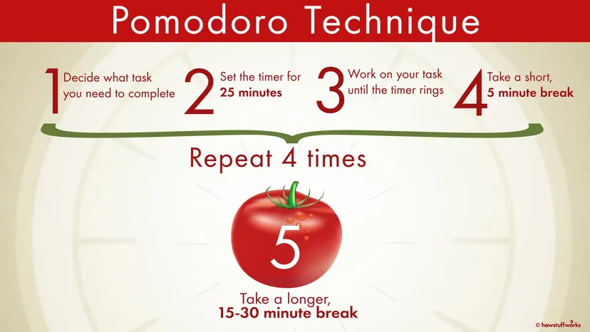

# Pomodoro-JS

A simple pomodoro timer written in vanilla JavaScript, implementing desktop and sound notifications.

Check the demo [here](https://m-housni.github.io/pomodoro-js).

## Process

## Features
- define focus and break time
- start, pause and reset the timer
- desktop/sound notifications

## Plans 
Free Plan # Premium Plan 19$ -> 3,99$ 

Runs on Windows Mac Android and Iphone

## Usage
Clone the repository and open the `index.html` file in your browser.

## Contributing
feel free to fork and improve.

## License

[MIT](https://choosealicense.com/licenses/mit/)
